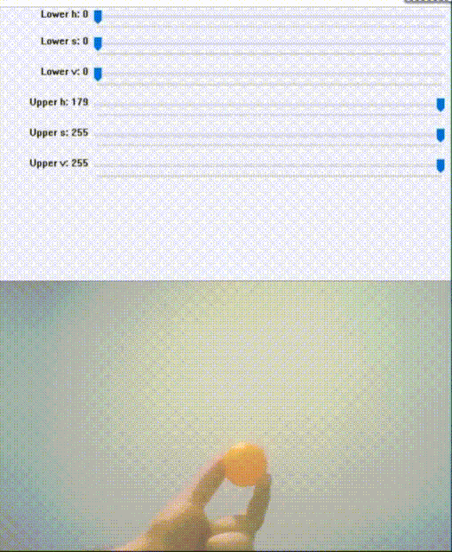

# Colored Object Tracker with OpenCV and Arduino

In this project, I wanted to make simple object tracker controlling a camera above servo motor.


## Getting Started


### Dependencies
This project requires the following dependencies:
* [Python](https://www.python.org/downloads)(>= 3)
* [NumPy](http://www.numpy.org)
* [OpenCV](https://opencv.org/releases/)
* [Arduino](https://www.arduino.cc/en/Main/Software)


## Usage
* Firstly, you have to change serial port and
```python
arduino = serial.Serial('COM7', 9600)
```
camera index in the **Tracker.py** .  If there is a single camera connected, just pass 0.
```python
cap=cv2.VideoCapture(0)
```
* Upload servoControl.ino to arduino and run the **Tracker.py**, set trackbars then, press "ESC" key to tracking.



## Acknowledgments
* [Trackbar as the Color Palette](https://opencv-python-tutroals.readthedocs.io/en/latest/py_tutorials/py_gui/py_trackbar/py_trackbar.html)
