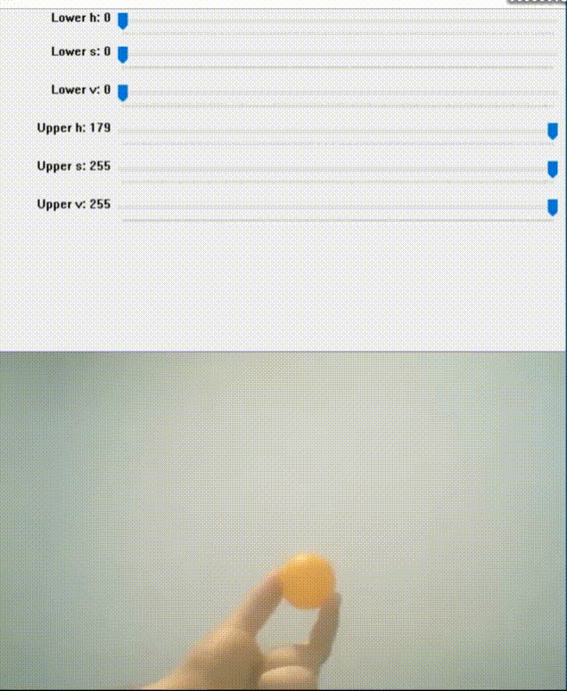

# Colored Object Tracker with OpenCV and Arduino

In this project, i wanted to make simple object tracker controlling a camera above servo motor.


## Getting Started


### Prerequisites

You have to install
* OpenCV
* Numpy

library for python 3.


## How to run
* Firstly, you have to change serial port and
```python
arduino = serial.Serial('COM7', 9600)
```
camera index in the **Tracker.py** .  If there is a single camera connected, just pass 0.
```python
cap=cv2.VideoCapture(0)
```
* Upload servoControl.ino to arduino and run the **Tracker.py**, set trackbars then, press "ESC" key.



## Acknowledgments
